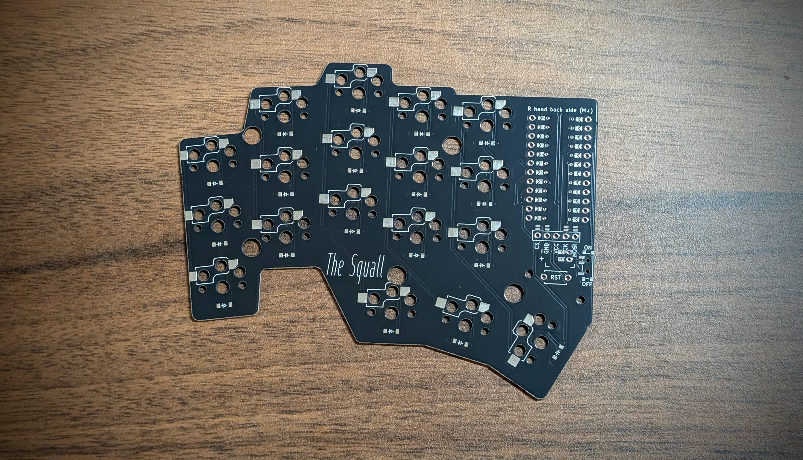

# The-Squall
Wireless split keyboard build based off of the Tempest which in turn is based on the Temper and Chocofi.

I wanted a splay for the outer columns slightly more agressive than the Tempestv2, but retain the thumb cluster placement of the Temper and Chocofi.

Included in the repo are the ergogen config and footprint files as well as the Kicad output and gerbers for both the PCB and the plates.

## Assembly:
Soldering of the jumpers for the controller, NiceView and the power connector is done on the back of the board. The same side as the sockets and diodes.
The power switch is also intended to be mounted on the underside of board.

